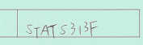
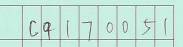
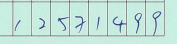

# S461F Data Science Project

# Introduction
The topic for this project is Deep Learning for Handwritten Characters recognition. 
 Our purpose is to create a model that can identfly the information of school exam papers. 
>What information we need to idenfly?
1. Course code
2. Student id
3. Exam number

# Objectives
1. Model accuracy >=95%
2. Identify the information(e.g., Course code, Exam number, Student number)
3. The model can recognize the English letters(A-Z) and digits(0-9)
4. Developed an application
5. Export the result to excel

# Method

