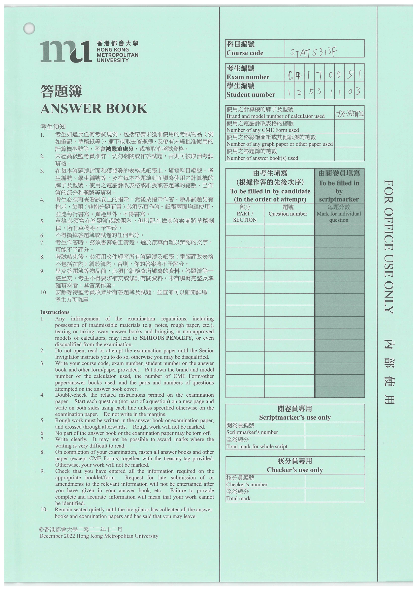

# S461F Data Science Project
# Handwritten Character Recognition System for Exam Papers

A deep learning-based system to recognize handwritten characters (digits 0–9, letters A–Z) in exam papers, automating data extraction for course codes, exam numbers, and student numbers. The system uses convolutional neural networks (CNNs), a user-friendly Tkinter GUI for manual region cropping, and exports results to Excel, reducing educator workload and errors.
 
 **Exam Paper Sample** 

# Demo Video
Watch the system in action, demonstrating PDF upload, region cropping, character recognition, and Excel export:

# Features
- High-Accuracy Recognition: Achieves 99% accuracy for digits and binary classification, 98% for letters using DigitNet, LetterNet, and BinaryNet CNNs.

- Manual Region Cropping: Users crop specific regions (e.g., course codes) via an intuitive GUI.

- Robust Preprocessing: Handles noisy inputs with CLAHE, adaptive thresholding, and morphological operations.
 
- Structured Data Export: Outputs recognized data to Excel for integration with grading systems.

- Modular Codebase: Organized into models, image processing, classification, GUI, and utility modules.

# Installtion

# Usage

# Project Structure

# Results

# Limitations and Future Work

# Acknowledgments

# Contact
oilaamt@gmail.com

