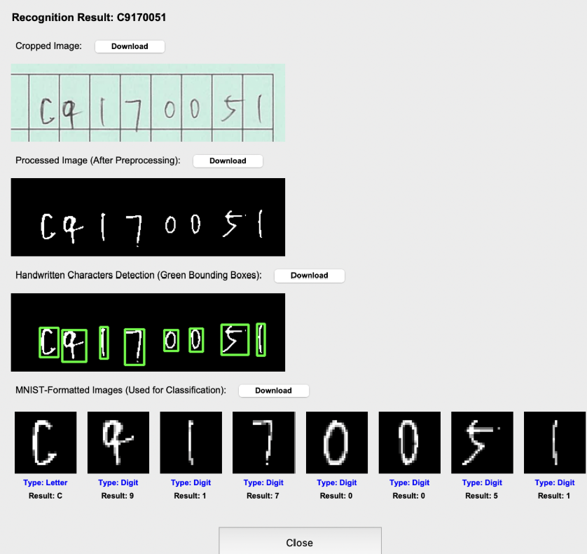
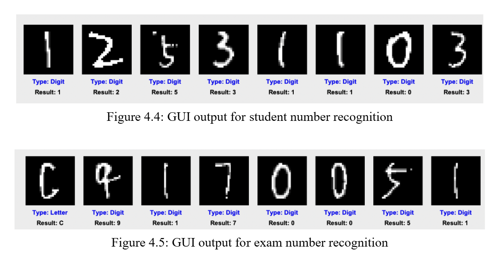

# S461F Data Science Project
# Handwritten Character Recognition System for Exam Papers

A deep learning-based system to recognize handwritten characters (digits 0–9, letters A–Z) in exam papers, automating data extraction for course codes, exam numbers, and student numbers. The system uses convolutional neural networks (CNNs), a user-friendly Tkinter GUI for manual region cropping, and exports results to Excel, reducing educator workload and errors.
<br>
<br>**Exam Paper Sample**<br/>


# Demo Video
Watch the system in action, demonstrating PDF upload, region cropping, character recognition, and Excel export:
<br>Click this line--->https://drive.google.com/file/d/17hfJWyP6_q138eyxMVeWRRzfl2pONjxK/view?resourcekey<br/>

# Features
- High-Accuracy Recognition: Achieves 99% accuracy for digits(DigitNet model), and binary classification(BinaryNet model), 98% for uppercase letters using LetterNet model.

- Manual Region Cropping: Users crop specific regions (e.g., course codes) via an intuitive GUI.

- Robust Preprocessing: Handles noisy inputs with CLAHE, adaptive thresholding, and morphological operations.
 
- Structured Data Export: Outputs recognized data to Excel for integration with grading systems.

- Modular Codebase: Organized into models, image processing, classification, GUI, and utility modules.


# Installtion
1. Clone the Repository:
  ```
git clone https://github.com/ClaudiaTam/S461F_DS_Project
  ```
3. Set Up Virtual Environment(Python 3.8+):
```
python -m venv venv
source venv/bin/activate  # Windows: venv\Scripts\activate
```
5. Install Dependencies:
```
pip install -r requirements.txt
```
7. Install Poppler(for PDFs):
   - Download Poppler and add `bin` to PATH
   - For Wins user, you can refer to this link below:
   - https://www.youtube.com/watch?v=oO6UeweyXnw
# Usage
I recommend to use PyCharm, it is much more convenient than vscode haha

1. Configure the HRC Paths
   - Open HRC/`HRC.py` in a text editor and search for "users"(e.g., `Ctrl+F`)
   - Replace the paths with your local Paths
  
   <br>**Example**<br/>
   - 
     
<br> <br/>    
2. Process a PDF in the GUI
   - Run the application
     ```
     python HRC.py
     ```
   - Upload a PDF in the GUI
   - Crop a region(e.g., course code "STAT S313F")
     - 
   <br> <br/>
   - Click “Classify” to recognize characters
   - Export to Excel

# Results
1. Model Performance
   - 
   - 
   - 
   <br> <br/>
   <br>**The Performance Summary of Models**<br/>
   - 
   

<br> <br/>

 2. Application Performance
    - **The Student Number and Exam Number Recognition:**
    - 
    - 
    - 
    - **The Course Code Recognition:**
    - 
    - 

# Limitations and Future Work
- **Limitations**: Manual cropping; BinaryNet misclassifies similar characters.
- **Future Work**: Automate cropping, add lowercase recognition.

# Acknowledgments
- **Datasets**: MNIST, EMNIST.
- **Libraries**: PyTorch, OpenCV, Tkinter.
- **Inspiration**: LeCun et al. (1998), Nockels et al. (2024).

# Contact
oilaamt@gmail.com


